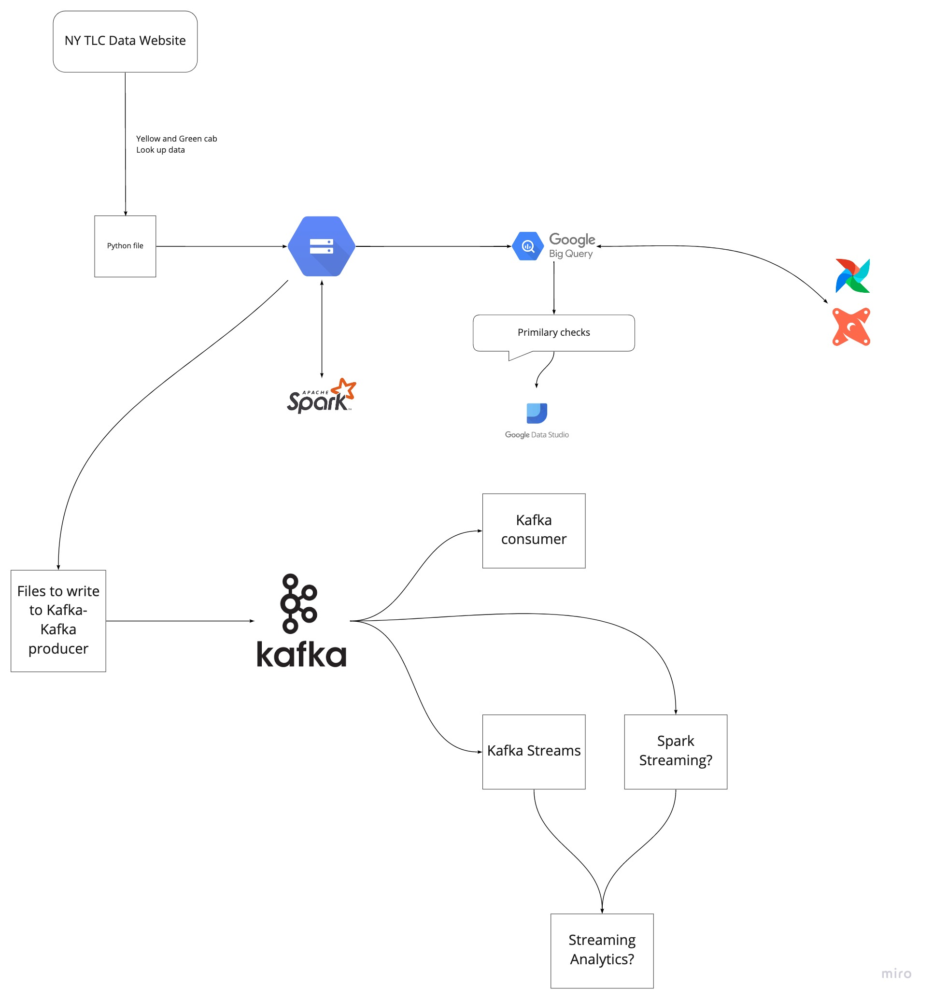

# Data Engineering Zoomcamp

I enrolled in this Boot/Zoomcamp (free) to expand my technology portfolio in the data engineering industry. Below are some of the most fundamental topics and tools covered for data engineers: Data ingestion, warehousing, streaming, analytics engineering, batch processing, google cloud platform, bigquery, docker, terraform, postgres, jupyter notebooks, etc. 

To reinforce learning, I complete homeworks, lectures, was involved with collaborating and debugging errors and discussing solutions in the slack channel, and a final project to get the certification. 

- **Start**: 17 January 2022
- Register in [DataTalks.Club's Slack](https://datatalks.club/slack.html)
- The [`#course-data-engineering`](https://app.slack.com/client/T01ATQK62F8/C01FABYF2RG) channel
- The videos are published to [DataTalks.Club's YouTube channel](https://www.youtube.com/c/DataTalksClub) in [the course playlist](https://www.youtube.com/playlist?list=PL3MmuxUbc_hJed7dXYoJw8DoCuVHhGEQb) 

## Syllabus

### [Week 1: Introduction & Prerequisites](week_1_basics_n_setup)

* Course overview
* Introduction to GCP
* Docker and docker-compose 
* Running Postgres locally with Docker
* Setting up infrastructure on GCP with Terraform
* Preparing the environment for the course
* Homework

[More details](week_1_basics_n_setup)

### [Week 2: Data ingestion](week_2_data_ingestion)

* Data Lake
* Workflow orchestration
* Setting up Airflow locally
* Ingesting data to GCP with Airflow
* Ingesting data to local Postgres with Airflow
* Moving data from AWS to GCP (Transfer service)
* Homework

[More details](week_2_data_ingestion)

### [Week 3: Data Warehouse](week_3_data_warehouse)

Goal: Structuring data into a Data Warehouse

* Data warehouse (BigQuery) (25 minutes)
    * What is a data warehouse solution
    * What is big query, why is it so fast, Cost of BQ,  (5 min)
    * Partitoning and clustering, Automatic re-clustering (10 min)
    * Pointing to a location in google storage (5 min)
    * Loading data to big query & PG (10 min) -- using Airflow operator?
    * BQ best practices
    * Misc: BQ Geo location, BQ ML 
    * Alternatives (Snowflake/Redshift)

### [Week 4: Analytics engineering](week_4_analytics_engineering/taxi_rides_ny/)

Goal: Transforming Data in DWH to Analytical Views

* Basics (15 mins)
    * What is DBT?
    * ETL vs ELT 
    * Data modeling
    * DBT fit of the tool in the tech stack
* Usage (Combination of coding + theory) (1:30-1:45 mins)
    * Anatomy of a dbt model: written code vs compiled Sources
    * Materialisations: table, view, incremental, ephemeral  
    * Seeds 
    * Sources and ref  
    * Jinja and Macros 
    * Tests  
    * Documentation 
    * Packages 
    * Deployment: local development vs production 
    * DBT cloud: scheduler, sources and data catalog (Airflow)
* Google data studio -> Dashboard
* Extra knowledge:
    * DBT cli (local)

### [Week 5: Batch processing](week_5_batch_processing)

Goal: 

* Distributed processing (Spark) (40 + ? minutes)
    * What is Spark, spark cluster (5 mins)
    * Explaining potential of Spark (10 mins)
    * What is broadcast variables, partitioning, shuffle (10 mins)
    * Pre-joining data (10 mins)
    * use-case
    * What else is out there (Flink) (5 mins)
* Extending Orchestration env (airflow) (30 minutes)
    * Big query on airflow (10 mins)
    * Spark on airflow (10 mins)

### [Week 6: Streaming](week_6_stream_processing)

* Basics
    * What is Kafka
    * Internals of Kafka, broker
    * Partitoning of Kafka topic
    * Replication of Kafka topic
* Consumer-producer
* Schemas (avro)
* Streaming
    * Kafka streams
* Kafka connect
* Alternatives (PubSub/Pulsar)

### [Week 7, 8 & 9: Project](project)

* Putting everything learned to practice

Duration: 2-3 weeks

* Focus
  *  Delta Lake/Lakehouse
    * Databricks
    * Apache iceberg
    * Apache hudi
  * Data mesh
  * KSQLDB
  * Streaming analytics
  * Mlops
  

## Overview

### Architecture diagram

### Technologies
* *Google Cloud Platform (GCP)*: Cloud-based auto-scaling platform by Google
  * *Google Cloud Storage (GCS)*: Data Lake
  * *BigQuery*: Data Warehouse
* *Terraform*: Infrastructure-as-Code (IaC)
* *Docker*: Containerization
* *SQL*: Data Analysis & Exploration
* *Airflow*: Pipeline Orchestration
* *DBT*: Data Transformation
* *Spark*: Distributed Processing
* *Kafka*: Streaming
